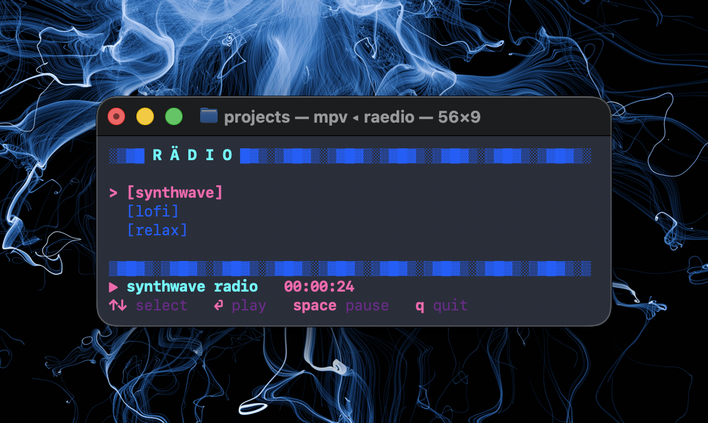

# rädio



minimalist terminal music player for YouTube livestreams.

## install

```
brew install yt-dlp mpv
cp raedio ~/.local/bin/
chmod +x ~/.local/bin/raedio
```

## use

run `raedio`. on first launch it seeds `~/.config/raedio/streams.toml`
with four streams (synthwave, lofi, relax, claude fm) and starts
playing synthwave automatically. edit the config to add or remove
bookmarks.

keys: `↑↓` or `j k` select, `⏎` play, `space` pause, `r` reboot,
`q` quit.
